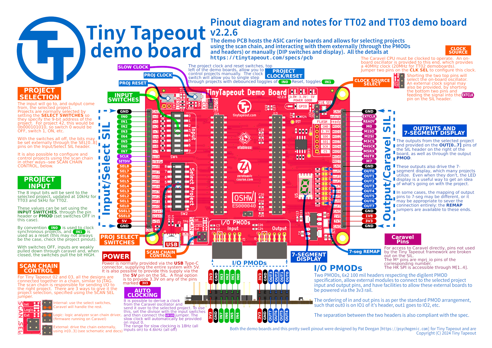
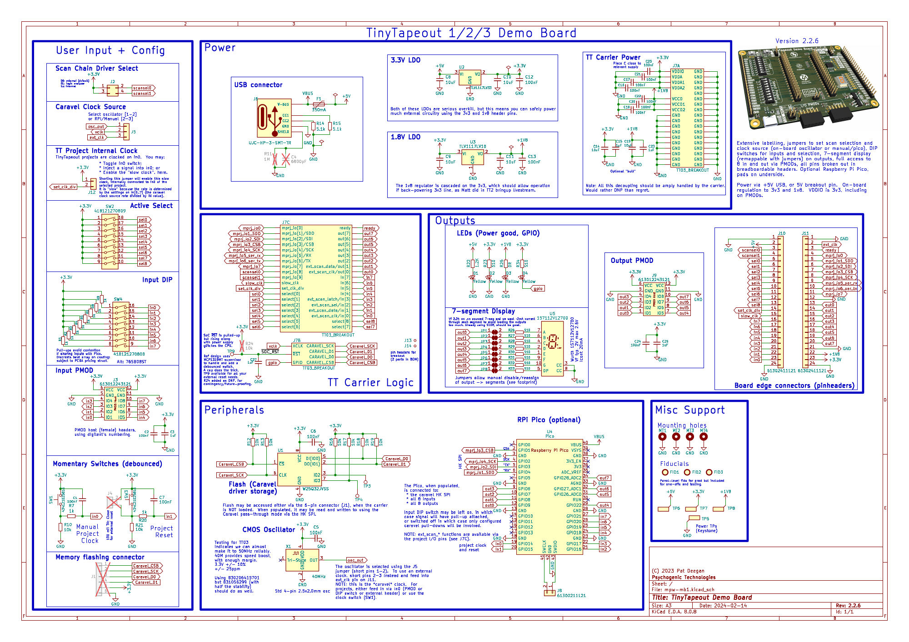

# Schematics for prior demoboard versions

Though this schematic and layout data is all preserved in the commit history, for ease of reference the major milestones are accessible here, in reverse chronological order.

These should be the revisions actually sent to production for distribution.  The PDF includes the full schematic and the preview gives access to the most important information, as the RP2040 support sheet basically doesn't change.

## TT07

With the TT07 demoboard, signal naming was uniformized (using *ui_in*, *uo_out*).

[Version 2.1.0 schematic PDF](demoboard-v2-1-0.pdf)

Commit a799acb3886b682b0f86c2f4d6155c08b5c505de from Wed Dec 11, 2024

## TT06

With TT06, the discreet MUX was dropped (along with Caravel support), the new much more comfortable piano switches were introduced for the input port.  The carrier format changed to break compatibility with prior boards, because of a new pinout and analog pin support.

[Version 2.0.1 schematic PDF](demoboard-v2-0-1.pdf)

Commit 292760e1f727d805be471b7700232c9482b70ae3 from Thu Oct 10, 2024

## TT05

[Version 1.2.3 schematic PDF](demoboard-v1-2-3.pdf)

Commit a88cbc08bdef564b16dc113f4489af65ff2ee86b from Tue Jun 11, 2024

## TT04

The TT04 demoboard introduced the RP2040, to handle selecting the projects through the ASIC project MUX.  TT04 boards also used a discreet multiplexer in order to provide enough pinnage to do all the things and have access to the caravel HK SPI safety net.

[Version 1.2.2 schematic PDF](demoboard-v1-2-2.pdf)

Commit cfdd80d7b79a667883998caccc05ebfad5d1b985 from Fri Apr 26, 2024

## TT02/TT03

Original demoboard used with TT02 and TT03.

[TT03 demoboard schematic PDF](demoboard-mpw-mb1.pdf)